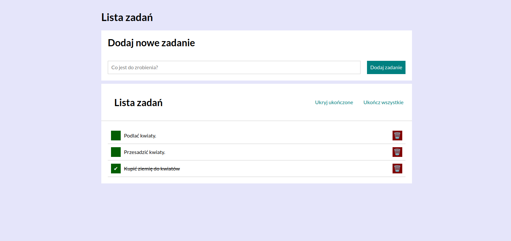

# Task-List

## Demo
https://dorotazielinska.github.io/Task-List/

This application is easy to use, please type in the first field ("Co jest do zrobienia?") what would you like to add to your task list, the next step is to
press button ("Dodaj zadanie") after that you will see bellow "Lista zadań" everything what you have added to your list. The green box you can use to mark that your task is done and red box is to remove your task from yours list.
Right now they are new two buttons "Ukryj ukończone" you can use it if you wants to hide tasks which are done. The second button "Ukończ wszystkie" is marking all tasks as done.

## Description
This application I created as a homework of my programing cours at You Code, the main task was to create the same looking aplication as was on 
presentation of homework.
The main prupose of that application is to make a list of tasks which would you like to do, to mark what you have done already and remove task from your
list.

## Technologies
- HTML
- CSS(grid,flex)
- JAVA SCRIPT(immutability)
- BEM convention
